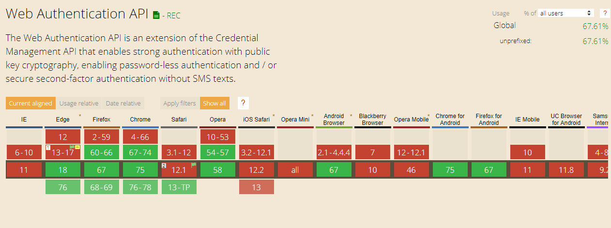

# SAFETECHio PHP FIDO2 Example


## Libraries

For details of the source libraries see [dedicated repo](https://github.com/SAFETECHio/FIDO2_SERVER_Libraries).

## Getting Started

If you don't have access to a running configured php server no problem you can use the docker container provided.

Open a new terminal window and navigate to the root director of this repo on your machine and enter

```bash
docker-composer up
```

Open another separate terminal and enter the following commands

```bash
docker exec -it fido2-example /bin/bash
cd app
composer install
```

After the installation of the packages dependencies has been completed navigate to the following URL

```text
http://localhost:8082/example/
```

Or click here [http://localhost:8082/example/](http://localhost:8082/example/).

## Browser Compatibility

To get the latest details of which version of which browsers offer support for WebAuthn please visit [Can I User WebAuthn](https://caniuse.com/#search=webauthn). As of writing (2019-06-28) the following browsers have support:



### Microsoft EDGE

Edge has support in version 18 and higher. However Edge is not updated independently of the operating system, this means that in order to update your version of Edge you will need to update your version of Windows 10.

Updating Windows 10 to the latest version may require a few steps, first check your computer has all pending updates installed by following [the instructions here](https://support.microsoft.com/en-gb/help/4027667/windows-10-update).

If after all available updates have been installed and your version of Edge is still lower than 17 you will need to manually update your OS. The [latest update for Windows 10 can be found here](https://www.microsoft.com/en-us/software-download/windows10).

This process may take a long time, so it may be easier to use a more popular browser that does support the latest in web security ;).
